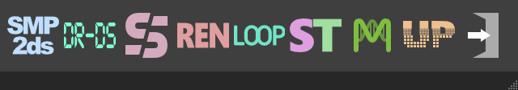
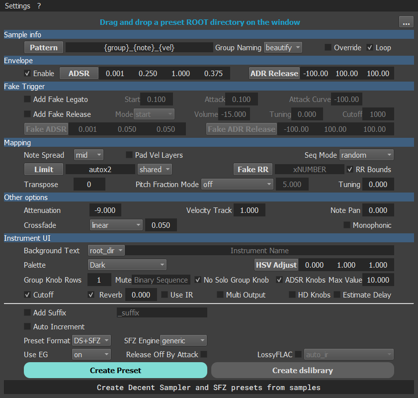
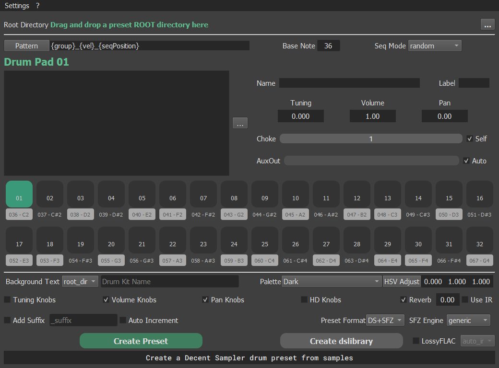
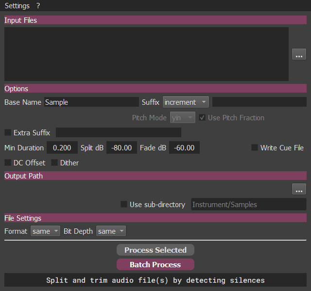
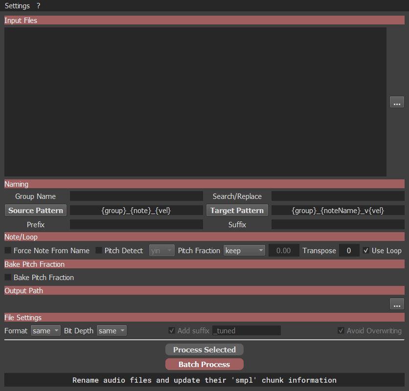
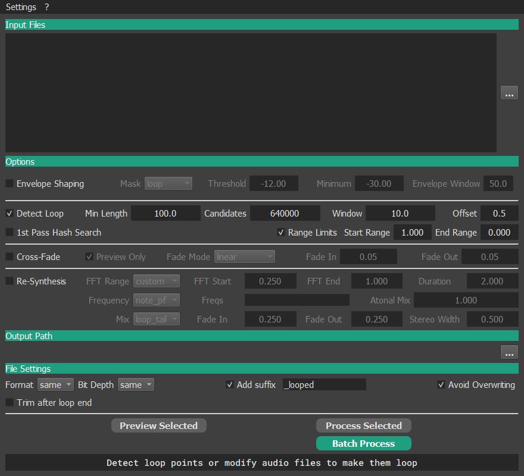
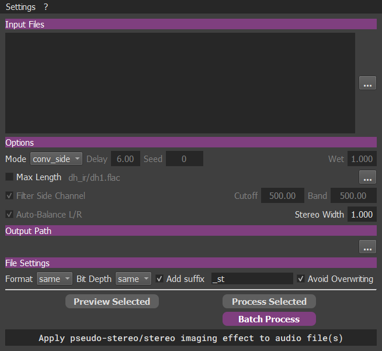
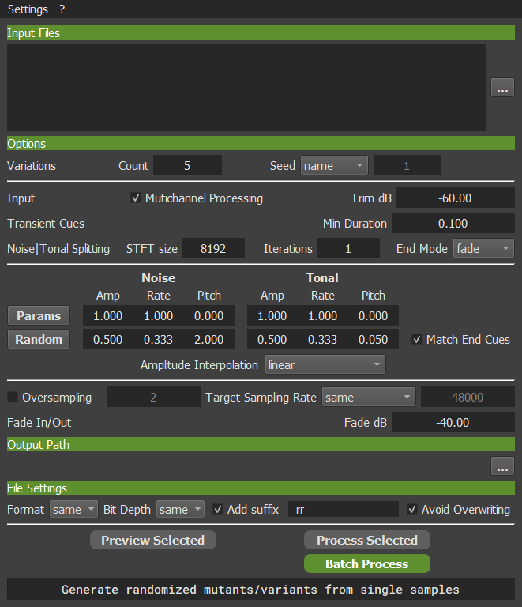

# SampleTools




Tools for creating and editing virtual sampled instruments, optimized for DecentSampler by David Hilowitz

https://www.decentsamples.com/product/decent-sampler-plugin/

## Installation

**For Windows users, an executable is available on this page, you don't need to install Python to use it**

This project was developed and tested with Python 3.12.8

Additional required packages all listed in provided requirements.txt

- chunkmuncher
- matplotlib
- mutagen
- noisereduce
- numpy
- pandas
- pillow
- PyQt5
- PyQt5_sip
- scipy
- sounddevice
- soundfile
- webcolors


- pyrubberband (for Mutate and Upsample tools only)<br/>
  pyrubberband requires [rubberband executable](https://breakfastquay.com/rubberband/) to be installed or copied in the
  program directory)

Clone repository and install required packages

```
git clone https://github.com/robotmitchum/sample_tools.git
cd sample_tools
pip install -r requirements.txt
```

or on MacOs

```
pip3 install -r requirements.txt
```

## Usage

Execute sample_tools_UI.py

```
python sample_tools_UI.py
```

or on MacOs

```
python3 ir_tool_UI.py
```

### Common features for most tools

- Drag and drop of files or directories (only the first level is scanned)
- Context menus with right click on many widgets for examples or presets
- Regular or looped Sample playback (Double click or Space Bar)
- Keyboard shortcuts for file list ( **Ctrl + A**, **Ctrl + I**, **Delete** )
- Visualization of **Waveform** and **Loop Point** ( **W**, **L** )
- Help is provided using tooltips for most widgets
- Backup, increment to avoid overwriting

**These tools use custom ID3 tags to handle metadata for the FLAC format which is recommended to get the most features**

## SMP2ds




Create Decent Sampler presets from samples in wav or flac format (limited support of aif)

Drag and drop a directory with a 'Samples' subdirectory in it to generate a dspreset file

- wav, flac (recommended) and aif (limited support, not recommended) as input for samples
- Samples are added and set according to their 'smpl' chunk/metadata (wav and flac only) and file name pattern matching

  Respect for pitch, pitch fraction, loop points
- Fake release, fake legato and fake round-robin features
- Automatic creation of a working UI with a customisable color theme
- wav, flac and aif IR files are supported for the convolution reverb, they must be located in an 'IR' subdirectory
- dslibrary file generation from a dspreset directory ready to use or distribute

### smp_attrib_cfg.json

Sample attributes Config

List of sample attributes offered by Decent Sampler and *hopefully* supported by this tool

Attribute values can be provided in the sample name (with some limitations depending on how the name is formatted)
or using ID3 tags (flac only at the moment, it should support any attribute, but I didn't test everything...)

This file found in this directory is required by this tool and should only be modified to recognize future Decent
Sampler features

- **Attribute names are case-sensitive!**
- **"smp_attrib"** key defines a list of basic attributes used by this tool
- **"ds_smp_attrib"** key defines a list of specific attributes recognized by Decent Sampler and described in its
  documentation
- **"num_attrib"** key defines a list of attributes which should be considered as numeric values

### instr_range.json

This file is used to define custom instrument ranges used by this tool when pressing the **limit** button

Use instrument names as keys with min and max MIDI note number provided as a list

## DR-DS




Create Decent Sampler drum presets from samples in wav, flac or aif

Similar to SMP2Ds but specialized for drum sets

Up to 32 drum pads though only the first 16 active drum pads will send their output to aux channels

Drag and drop a directory with a 'Samples' subdirectory containing drum samples on the root directory widget

Assign samples to drum pads by dropping one or several files (for velocity and round-robin) on them

- Each drum pad can choke itself and any other pad
- Support for velocity and round-robin according to file names with pattern matching
- Automatic creation of a working UI with a customisable color theme


- wav, flac and aif IR files are supported for the convolution reverb, they must be located in an 'IR' subdirectory
- dslibrary file generation from a dspreset directory ready to use or distribute

## Split Audio Tool




Split and trim audio file(s) by detecting silences

Typical use cases : note by note instrument recordings, audio sample CDs tracks

Input audio files are split into several samples and renamed according user defined options

- wav, aif, flac as input
- Number increment
- Custom suffixes
- Note number or name using automatic pitch detection
- Automatic micro fade in/out to eliminate potential popping
- wav, aif, flac as output

## Rename Sample Tool




Renaming, conversion of audio files using pattern matching, pitch detection

Update their 'smpl' chunk/metadata accordingly, so they are properly conformed for SMP2ds or Kontakt (wav only)

- wav, aif, flac as input
- wav and flac output

## Loop Tool




Detect loop points or modify audio files to make them loop

- wav, aif, flac as input
- Batch auto-detection of loop points using zero crossing and auto correlation
- FFT re-synthesis
- wav and flac output

## Stereo Tool




Apply pseudo-stereo/stereo imaging effects to mono audio file(s)

- wav, aif, flac as input
- Haas, Velvet, Convolution, Side Convolution
- wav, flac output

## Mutate Tool




Generate randomized mutants/variants from single samples

- Detect transient cues from input samples
- Separate noise and tonal content
- randomize amplitude, time rate and pitch differently for tone and noise using found cues

Typical usages: generate round-robins samples, sound design

- wav, aif, flac as input
- wav and flac output

## Upsample Tool


Up-sample audio file(s) using spectral band replication and denoising to improve old 8 bits samples

- wav, aif, flac as input
- wav and flac output

## License

MIT License

Copyright (c) 2024 Michel 'Mitch' Pecqueur

Permission is hereby granted, free of charge, to any person obtaining a copy of this software and associated
documentation files (the "Software"), to deal in the Software without restriction, including without limitation the
rights to use, copy, modify, merge, publish, distribute, sublicense, and/or sell copies of the Software, and to permit
persons to whom the Software is furnished to do so, subject to the following conditions:

The above copyright notice and this permission notice shall be included in all copies or substantial portions of the
Software.

THE SOFTWARE IS PROVIDED "AS IS", WITHOUT WARRANTY OF ANY KIND, EXPRESS OR IMPLIED, INCLUDING BUT NOT LIMITED TO THE
WARRANTIES OF MERCHANTABILITY, FITNESS FOR A PARTICULAR PURPOSE AND NONINFRINGEMENT. IN NO EVENT SHALL THE AUTHORS OR
COPYRIGHT HOLDERS BE LIABLE FOR ANY CLAIM, DAMAGES OR OTHER LIABILITY, WHETHER IN AN ACTION OF CONTRACT, TORT OR
OTHERWISE, ARISING FROM, OUT OF OR IN CONNECTION WITH THE SOFTWARE OR THE USE OR OTHER DEALINGS IN THE SOFTWARE.